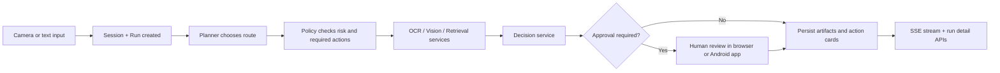

# SceneCopilot

SceneCopilot is a wearable-first AI runtime for scene inspection, text reading,
document-grounded guidance, and approval-aware next-step decisions.

It is built around three operator surfaces:

- `Android Java field client` for camera capture, gallery input, TTS, and live run updates
- `Browser control deck` for approvals, run forensics, knowledge ingest, and evaluation review
- `FastAPI runtime` for orchestration, provider routing, retrieval, persistence, and SSE

## What ships today

- real-time run lifecycle with durable `session_id` and `run_id`
- explicit `planner -> policy -> services -> providers` execution layering
- scene OCR, scene analysis, decision recommendation, and approval gating
- hybrid document retrieval with chunking, SQLite FTS, and local hashed embeddings
- optional external search enrichment for explicit operator lookups
- structured run artifacts, audit trail, approval records, and action cards
- bounded scheduler with backpressure and run-scoped SSE streams
- evaluation harness with latency, retrieval, OCR, and fallback metrics
- capture profiles that switch client cadence, audio chunking, and backend alignment policy together
- backend scan-window aggregation that coalesces nearby live frames into one run before OCR, retrieval, and decision work
- pressure-aware aggregation policy that widens the short capture window when the run queue is busy and rolls windows on scene breaks

## Runtime Loop



## Monorepo Layout

```text
scenecopilot/
├── README.md
├── .env.example
├── backend/
│   ├── pyproject.toml
│   ├── app/
│   │   ├── main.py
│   │   ├── config.py
│   │   ├── db.py
│   │   ├── seed.py
│   │   ├── agent/
│   │   ├── orchestration/
│   │   ├── providers/
│   │   ├── routes/
│   │   └── services/
│   └── data/
│       ├── evals/
│       ├── seed/
│       ├── uploads/
│       └── watched/
├── frontend-android/
│   ├── settings.gradle
│   ├── build.gradle
│   └── app/
└── docs/
    ├── architecture.md
    ├── system-blueprint.md
    └── implementation-roadmap.md
```

## Backend Quick Start

Python 3.11+ is enough. `uv` is optional.

```bash
cd backend
python3 -m venv .venv
source .venv/bin/activate
pip install -e .
cp ../.env.example .env
python -m app.seed
uvicorn app.main:app --reload --port 8002
```

Core routes:

- `GET /`
- `GET /dashboard`
- `GET /api/health`
- `POST /api/chat`
- `POST /api/audio/analyze`
- `POST /api/audio/chunk`
- `POST /api/frame/latest`
- `GET /api/frame/latest/peek?session_key=...`
- `POST /api/scans/analyze`
- `GET /api/events/{session_id}`
- `GET /api/runs/{run_id}`
- `POST /api/runs/{run_id}/approve`
- `POST /api/documents/upload`
- `GET /api/documents/search?q=...`
- `GET /api/dashboard/summary`
- `GET /api/system/metrics`
- `GET /api/state`

## Operator Surfaces

### Browser Control Deck

Open `/dashboard` to:

- launch text or image runs
- review recent runs and queue pressure
- inspect run artifacts, approvals, scene captures, and audit trail
- upload manuals, SOPs, and reference cards
- test retrieval with optional external enrichment
- resolve blocked runs directly from the browser
- review the latest evaluation baseline

### Android Java Field Client

Open `frontend-android/` in Android Studio. The app currently supports:

- CameraX live preview with paced keyframe capture and timeout recovery
- direct camera capture
- gallery image submission
- voice prompt input through the system speech recognizer
- AudioRecord-based PCM capture with file-backed live chunk streaming for backend ASR
- client-side speech gating with push-to-talk long press and low-latency chunk cadence
- chunked audio upload protocol for incremental speech ingest, including PCM16 capture assembled into WAV on the backend while recording is still in progress
- session-scoped temporal alignment between recent audio windows and captured live frames
- transcript reuse for aligned audio windows to reduce repeated ASR latency on nearby scene runs
- sliding multimodal audio window selection for scene runs, including multi-window transcript aggregation when needed
- adaptive live keyframe gating on Android so stable scenes are locally suppressed, while center reading regions and lower action bands can still trigger uploads on small but important changes
- shared `Eco / Balanced / Expert` capture profiles that retune live cadence, heartbeat windows, VAD sensitivity, and audio chunk size without changing the backend contract
- backend scan-window aggregation that buffers nearby keyframes for a short profile-driven window, then launches one run against the retained latest frame
- adaptive backend aggregation that can widen its buffer under queue pressure and force a rollover when a new frame lands far outside the current scene gap
- latest-frame stash support for external wearable bridges that want to keep only one pending frame per session
- live SSE event stream
- run detail inspection with artifacts and approvals
- document search
- Android TTS playback

Emulators should use `http://10.0.2.2:8002/`. Physical devices should update
the base URL in
`frontend-android/app/src/main/java/com/scenecopilot/app/network/ApiClient.java`.

## Runtime Qualities

- bounded async scheduler with queue backpressure and overload rejection
- profile-driven scan-window aggregation that reduces duplicate OCR and scene runs during short bursts of motion
- queue-aware aggregation pressure control, so busy systems prefer one denser run over several near-duplicate scene runs
- explicit run states from `queued` through `completed`, `failed`, or `cancelled`
- code-level policy gates for OCR strategy, retrieval path, and approval flow
- replaceable OCR, vision, speech, retrieval, embedding, and decision providers
- run-scoped artifacts for OCR output, scene observations, retrieval hits, and recommendations
- SSE replay and run filtering for reconnect-safe clients, with bounded per-subscriber queues that drop oldest events under pressure
- SQLite WAL mode, FTS-backed search, and durable run/event storage
- latest-frame stash TTL cleanup and watcher handled-key TTL cleanup to prevent long-lived process state growth
- buffered scan-window TTL cleanup and metrics so abandoned live windows do not accumulate in memory or on disk
- cloud vision uploads are pre-scaled before base64 packaging so provider calls do not blindly forward full-size camera frames
- process-time response headers and system metrics endpoints

## Knowledge Layer

SceneCopilot indexes manuals and SOPs into retrieval chunks and ranks them with
a hybrid strategy:

- chunked text windows with overlap
- SQLite FTS lexical recall
- local hashed embeddings for deterministic vector scoring
- reranking into retrieval artifacts that can be audited per run
- optional external search enrichment for explicit operator searches

This keeps the default stack portable while still allowing cloud-backed
providers when you want higher-fidelity OCR or scene understanding.

## Runtime Profiles

### Capture Modes

SceneCopilot exposes the same capture profile in the Android client and browser
deck, and the backend records it in run inputs, alignment artifacts, and audio
window metadata.

- `Eco`: slower heartbeat, stricter scene-change threshold, and larger audio chunks
- `Balanced`: adaptive default for everyday field use
- `Expert`: faster cadence, lower change threshold, smaller audio chunks, and denser alignment windows

### Offline-Ready Baseline

The default setup works without cloud model keys:

- local OCR provider
- local vision provider
- local decision provider
- local speech provider with lazy-loaded `faster-whisper` on `cpu/int8`
- local hashed embedding provider
- SQLite retrieval provider

This is useful for demos, local development, and deterministic regression runs.

### Cloud-Enhanced Mode

To route OCR, vision, or decision work through Anthropic-backed providers, set:

```bash
SCENECOPILOT_OCR_PROVIDER=anthropic
SCENECOPILOT_VISION_PROVIDER=anthropic
SCENECOPILOT_DECISION_PROVIDER=anthropic
ANTHROPIC_API_KEY=...
```

You can mix local and remote providers per capability.

To route speech transcription through the OpenAI transcription API, set:

```bash
SCENECOPILOT_SPEECH_PROVIDER=openai
OPENAI_API_KEY=...
SCENECOPILOT_OPENAI_TRANSCRIBE_MODEL=gpt-4o-mini-transcribe
```

## Evaluation Baseline

Run:

```bash
cd backend
python3 -m app.evals.harness
```

The evaluation harness records:

- OCR accuracy
- retrieval hit rate
- high-risk miss rate
- average latency
- p95 latency
- provider fallback success rate

The latest result is written to
`backend/data/evals/latest_eval.json` and is surfaced in the browser control
deck.

## Architecture Notes

The repo already contains the larger-scale expansion path in:

- [docs/architecture.md](./docs/architecture.md)
- [docs/system-blueprint.md](./docs/system-blueprint.md)
- [docs/implementation-roadmap.md](./docs/implementation-roadmap.md)

These documents cover the runtime kernel, service boundaries, provider
contracts, and staged rollout toward a broader multimodal operations platform.

## Demo Flow

1. Start the backend and seed the sample data.
2. Upload a manual or SOP if you want domain-specific guidance.
3. Launch a scene run from Android or the browser deck.
4. Watch the SSE stream and inspect the run detail.
5. Approve or reject blocked recommendations if the policy requires review.
6. Re-run the evaluation harness and compare the new baseline in `/dashboard`.
